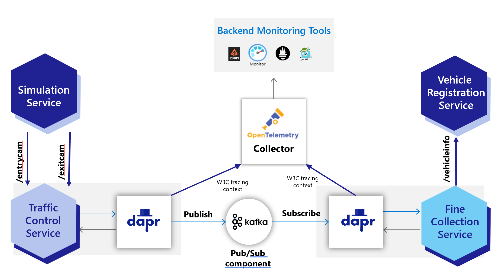

# Dapr Workshop for Pub/Sub and Observability in Java

## Introduction

This workshop teaches you how to apply [Dapr](https://dapr.io) to a Java microservices application using Pub/Sub with Kafka.

### The domain

For the assignments you will be working with a speeding-camera setup as can be found on several Dutch highways. This is an overview of the fictitious setup you're simulating:

There's 1 entry-camera and 1 exit-camera per lane. When a car passes an entry-camera, the license-number of the car and the timestamp is registered.

When the car passes an exit-camera, this timestamp is also registered by the system. The system then calculates the average speed of the car based on the entry- and exit-timestamp. If a speeding violation is detected, a message is sent to the Central Fine Collection Agency (or CJIB in Dutch). They will retrieve the information of the owner of the vehicle and send him or her a fine.

### Architecture

In order to simulate this in code, the following services are defined:

1. The **Camera Simulation** generates a random license-number and sends a *VehicleRegistered* message (containing this license-number, a random entry-lane (1-3) and the timestamp) to the `/entrycam` endpoint of the TrafficControlService.
2. The **Traffic Control Service** stores the *VehicleState* (license-number and entry-timestamp).
3. After some random interval, the Camera Simulation sends a *VehicleRegistered* message to the `/exitcam` endpoint of the TrafficControlService (containing the license-number generated in step 1, a random exit-lane (1-3) and the exit timestamp).
4. The TrafficControlService retrieves the *VehicleState* that was stored at vehicle entry.
5. The TrafficControlService calculates the average speed of the vehicle using the entry- and exit-timestamp. It also stores the *VehicleState* with the exit timestamp for audit purposes, but this is left out of the sequence diagram for clarity.
6. If the average speed is above the speed-limit, the TrafficControlService publishes *SpeedingViolation* payload to kafka topic *test*. 
7. The FineCollectionService subscribes to kafka topic *test*.
8. The FineCollectionService calculates the fine for the speeding-violation.
9. The FineCollectionSerivice calls the `/vehicleinfo/{license-number}` endpoint of the VehicleRegistrationService with the license-number of the speeding vehicle to retrieve its vehicle- and owner-information.
10. The **Vehicle Registration Service** offers 1 HTTP endpoint: `/getvehicleinfo/{license-number}` for getting the vehicle- and owner-information of a vehicle.

### End-state with Dapr applied

After completing all the assignments, the architecture has been changed to work with Dapr and should look like this:

