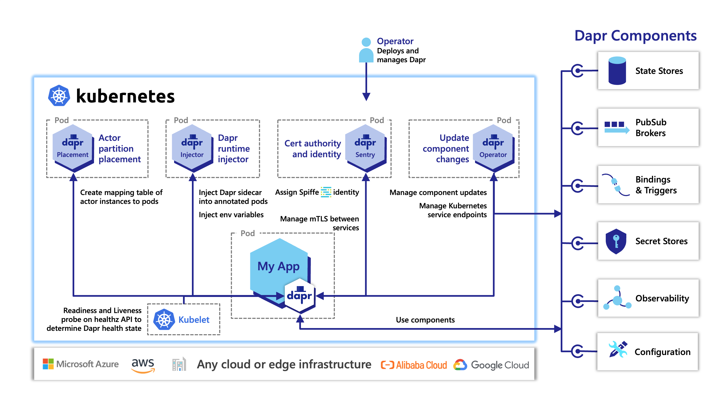

# Dapr Sidecar architecture

* Dapr exposes its HTTP and gRPC APIs as a sidecar architecture, either as a container or as a process, not requiring the application code to include any Dapr runtime code.

* Deploying and running a Dapr-enabled application into your Kubernetes cluster is as simple as adding a few annotations to the deployment schemes.
* Let's inspect deployment file of TrafficControlService

```yml
apiVersion: apps/v1
kind: Deployment
metadata:
  creationTimestamp: null
  labels:
    app: trafficcontrolservice
  name: trafficcontrolservice
spec:
  replicas: 1
  selector:
    matchLabels:
      app: trafficcontrolservice
  strategy: {}
  template:
    metadata:
      creationTimestamp: null
      labels:
        app: trafficcontrolservice
      annotations:
        dapr.io/enabled: "true"
        dapr.io/app-id: "trafficcontrolservice"
        dapr.io/app-port: "6000"        
    spec:
      containers:
      - image: daprworkshopjava.azurecr.io/traffic-control-service:latest
        name: traffic-control-service
        resources: {}
status: {}
```

* As you can see, the below annotation inserts Dapr sidecar to the deployment

```yml
      annotations:
        dapr.io/enabled: "true"
```